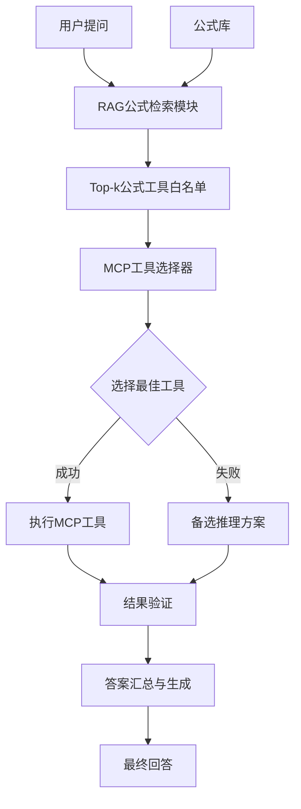

# 基于RAG与MCP的公式智能问答系统

## 一、系统架构设计

### 1.1 整体架构图



### 1.2 核心组件说明

| 组件 | 功能 | 关键技术 |
|------|------|----------|
| RAG检索模块 | 根据用户问题检索相关公式 | Sentence-BERT, BM25, Cross-Encoder |
| MCP工具注册表 | 管理所有公式计算工具 | 工具定义、参数解析、安全执行 |
| 工具选择器 | 智能选择最佳计算工具 | 相似度匹配、参数验证 |
| 执行引擎 | 安全执行选定工具 | Docker沙箱、资源限制 |
| 结果聚合器 | 汇总多个工具结果生成答案 | 投票机制、置信度计算 |

## 二、MCP服务定义与工具注册

### 2.1 MCP服务框架

```python
class MCPService:
    """MCP服务管理器"""
    
    def __init__(self):
        self.tools = {}
        self.formula_index = {}
        self.rag_retriever = RAGRetriever()
        
    def register_tool(self, tool_name: str, formula: str, tool_func: callable, 
                     description: str, parameters: dict) -> None:
        """
        注册MCP工具
        
        参数:
            tool_name: 工具唯一标识
            formula: 对应的LaTeX公式
            tool_func: 工具执行函数
            description: 工具描述
            parameters: 参数定义
        """
        self.tools[tool_name] = {
            'function': tool_func,
            'formula': formula,
            'description': description,
            'parameters': parameters,
            'metadata': {
                'created_at': datetime.now(),
                'usage_count': 0,
                'success_rate': 1.0
            }
        }
        
        # 建立公式到工具的映射
        self.formula_index[formula] = tool_name
    
    def get_tool_whitelist(self, question: str, top_k: int = 3) -> List[str]:
        """
        通过RAG检索获取工具白名单
        
        返回:
            相关工具名称列表，按相关性排序
        """
        # 使用RAG检索最相关的公式
        relevant_formulas = self.rag_retriever.retrieve(
            query=question,
            formulas=list(self.formula_index.keys()),
            top_k=top_k*2  # 获取更多候选进行筛选
        )
        
        # 转换为工具名并去重
        tool_names = []
        for formula in relevant_formulas:
            if formula in self.formula_index:
                tool_name = self.formula_index[formula]
                if tool_name not in tool_names:
                    tool_names.append(tool_name)
                    if len(tool_names) >= top_k:
                        break
        
        return tool_names
```

### 2.2 10个MCP工具定义

基于之前解析的10个公式，定义对应的MCP工具：

```python
# 工具1: 导数计算工具
def derivative_calculator(f_expression: str, point: float, variable: str = 'x') -> dict:
    """
    计算函数在某点的导数
    
    参数:
        f_expression: 函数表达式，如 "x**2 + 3*x + 5"
        point: 求导点
        variable: 变量名，默认为'x'
    
    返回:
        包含导数值和计算过程的字典
    """
    import sympy as sp
    
    var = sp.symbols(variable)
    f = sp.sympify(f_expression)
    f_prime = sp.diff(f, var)
    derivative_value = float(f_prime.subs(var, point))
    f_value = float(f.subs(var, point))
    
    return {
        'function': str(f),
        'derivative': str(f_prime),
        'derivative_at_point': derivative_value,
        'function_value_at_point': f_value,
        'point': point,
        'calculation': f"f'({point}) = {derivative_value}"
    }

# 工具2: 牛顿第二定律计算工具
def newtons_second_law(mass: float, acceleration: float) -> dict:
    """
    根据牛顿第二定律计算力
    F = ma
    """
    force = mass * acceleration
    
    return {
        'force': force,
        'mass': mass,
        'acceleration': acceleration,
        'units': 'N (Newtons)',
        'interpretation': f'质量为{mass}kg的物体以{acceleration}m/s²加速时，需要{force}N的力'
    }

# 工具3: 均值计算工具
def mean_calculator(data: List[float]) -> dict:
    """
    计算数据集的算术平均值
    \bar{x} = \frac{1}{n} \sum_{i=1}^{n} x_i
    """
    import numpy as np
    
    data_array = np.array(data)
    n = len(data_array)
    mean_value = np.mean(data_array)
    
    return {
        'mean': float(mean_value),
        'sample_size': n,
        'sum': float(np.sum(data_array)),
        'data_range': {
            'min': float(np.min(data_array)),
            'max': float(np.max(data_array))
        },
        'standard_deviation': float(np.std(data_array))
    }

# 工具4: 复利计算工具
def compound_interest_calculator(principal: float, rate: float, time: float, 
                               compounding_periods: int = 1) -> dict:
    """
    计算复利
    A = P(1 + r/n)^{nt}
    """
    A = principal * (1 + rate/compounding_periods) ** (compounding_periods * time)
    interest = A - principal
    
    # 生成逐年增长数据
    years = list(range(int(time) + 1))
    values = [principal * (1 + rate/compounding_periods) ** (compounding_periods * year) 
              for year in years]
    
    return {
        'future_value': A,
        'principal': principal,
        'interest_earned': interest,
        'annual_rate': rate,
        'time_years': time,
        'growth_data': dict(zip(years, values))
    }

# 工具5: 应力计算工具
def stress_calculator(force: float, area: float) -> dict:
    """
    计算材料应力
    σ = F/A
    """
    stress = force / area
    
    # 材料强度参考值(Pa)
    material_strength = {
        'mild_steel': 250e6,
        'aluminum_6061': 276e6,
        'concrete': 40e6,
        'oak_wood': 9e6
    }
    
    safety_margins = {}
    for material, strength in material_strength.items():
        if stress > 0:
            safety_margins[material] = strength / stress
    
    return {
        'stress': stress,
        'force': force,
        'area': area,
        'units': 'Pa',
        'material_safety_margins': safety_margins,
        'critical': stress > 200e6  # 超过200MPa通常认为危险
    }

# 工具6: 热量计算工具
def heat_calculator(mass: float, specific_heat: float, 
                   temperature_change: float) -> dict:
    """
    计算热量变化
    Q = mcΔT
    """
    Q = mass * specific_heat * temperature_change
    
    # 能量单位转换
    conversions = {
        'joules': Q,
        'kilojoules': Q / 1000,
        'calories': Q / 4.184,
        'kilocalories': Q / 4184,
        'BTU': Q / 1055.06
    }
    
    return {
        'heat_energy': Q,
        'mass': mass,
        'specific_heat': specific_heat,
        'temperature_change': temperature_change,
        'energy_conversions': conversions
    }

# 工具7: 欧姆定律计算工具
def ohms_law_calculator(voltage: float = None, current: float = None, 
                        resistance: float = None) -> dict:
    """
    欧姆定律计算
    V = IR
    提供任意两个参数，计算第三个
    """
    if sum(x is not None for x in [voltage, current, resistance]) != 2:
        raise ValueError("必须提供且仅提供两个参数")
    
    if voltage is None:
        voltage = current * resistance
    elif current is None:
        current = voltage / resistance
    elif resistance is None:
        resistance = voltage / current
    
    power = voltage * current
    
    return {
        'voltage': voltage,
        'current': current,
        'resistance': resistance,
        'power': power,
        'units': {
            'voltage': 'V',
            'current': 'A',
            'resistance': 'Ω',
            'power': 'W'
        }
    }

# 工具8: 圆面积计算工具
def circle_area_calculator(radius: float) -> dict:
    """
    计算圆面积和周长
    A = πr²
    C = 2πr
    """
    import math
    
    area = math.pi * radius ** 2
    circumference = 2 * math.pi * radius
    
    return {
        'area': area,
        'circumference': circumference,
        'radius': radius,
        'diameter': 2 * radius,
        'area_to_circumference_ratio': area / circumference
    }

# 工具9: 条件概率计算工具
def conditional_probability_calculator(p_a: float, p_b_given_a: float, 
                                      p_b: float = None) -> dict:
    """
    计算条件概率
    P(A|B) = P(A∩B) / P(B)
    """
    p_a_and_b = p_a * p_b_given_a
    
    if p_b is None:
        # 假设A和B独立
        p_b = p_a_and_b / p_a if p_a > 0 else 0
    
    if p_b > 0:
        p_a_given_b = p_a_and_b / p_b
    else:
        p_a_given_b = 0
    
    return {
        'p_a': p_a,
        'p_b': p_b,
        'p_b_given_a': p_b_given_a,
        'p_a_given_b': p_a_given_b,
        'p_a_and_b': p_a_and_b,
        'independent': abs(p_a_and_b - p_a * p_b) < 1e-10
    }

# 工具10: 光子能量计算工具
def photon_energy_calculator(frequency: float = None, 
                            wavelength: float = None) -> dict:
    """
    计算光子能量
    E = hν = hc/λ
    提供频率或波长之一
    """
    h = 6.62607015e-34  # 普朗克常数
    c = 299792458      # 光速
    
    if frequency is not None:
        energy = h * frequency
        wavelength_calc = c / frequency if frequency > 0 else float('inf')
    elif wavelength is not None:
        energy = h * c / wavelength
        frequency_calc = c / wavelength if wavelength > 0 else 0
    else:
        raise ValueError("必须提供频率或波长")
    
    energy_ev = energy / 1.602176634e-19
    
    return {
        'energy_joules': energy,
        'energy_electronvolts': energy_ev,
        'frequency': frequency if frequency is not None else frequency_calc,
        'wavelength': wavelength if wavelength is not None else wavelength_calc,
        'radiation_type': classify_radiation(energy_ev)
    }
```

### 2.3 工具注册

```python
def setup_mcp_service() -> MCPService:
    """初始化MCP服务并注册所有工具"""
    
    mcp_service = MCPService()
    
    # 注册所有工具
    mcp_service.register_tool(
        tool_name='derivative_calculator',
        formula='\\lim_{x \\to a} \\frac{f(x) - f(a)}{x - a} = f\'(a)',
        tool_func=derivative_calculator,
        description='计算函数在某点的导数',
        parameters={
            'f_expression': {'type': 'str', 'required': True, 'description': '函数表达式'},
            'point': {'type': 'float', 'required': True, 'description': '求导点'},
            'variable': {'type': 'str', 'required': False, 'default': 'x'}
        }
    )
    
    mcp_service.register_tool(
        tool_name='newtons_second_law',
        formula='F = ma',
        tool_func=newtons_second_law,
        description='根据牛顿第二定律计算力',
        parameters={
            'mass': {'type': 'float', 'required': True, 'description': '质量(kg)'},
            'acceleration': {'type': 'float', 'required': True, 'description': '加速度(m/s²)'}
        }
    )
    
    # 注册其余8个工具（类似方式）
    # ...
    
    return mcp_service
```

## 三、RAG增强的智能工具选择

### 3.1 RAG检索模块实现

```python
class RAGRetriever:
    """RAG公式检索模块"""
    
    def __init__(self, embedding_model='BAAI/bge-large-zh'):
        from sentence_transformers import SentenceTransformer
        from rank_bm25 import BM25Okapi
        
        self.embedding_model = SentenceTransformer(embedding_model)
        self.bm25 = None
        self.formulas = []
        self.formula_embeddings = None
        
    def index_formulas(self, formulas: List[str]) -> None:
        """索引所有公式"""
        self.formulas = formulas
        
        # 构建BM25索引
        tokenized_formulas = [self._tokenize(f) for f in formulas]
        self.bm25 = BM25Okapi(tokenized_formulas)
        
        # 生成稠密嵌入
        self.formula_embeddings = self.embedding_model.encode(
            formulas, show_progress_bar=True
        )
    
    def retrieve(self, query: str, top_k: int = 5, 
                use_rerank: bool = True) -> List[Tuple[int, float, str]]:
        """
        检索相关公式
        
        返回:
            列表，每个元素为(索引, 分数, 公式)
        """
        # 第一层：BM25检索
        tokenized_query = self._tokenize(query)
        bm25_scores = self.bm25.get_scores(tokenized_query)
        
        # 取top 2k个候选
        bm25_top_k = min(20, len(self.formulas))
        bm25_indices = bm25_scores.argsort()[-bm25_top_k:][::-1]
        
        if not use_rerank:
            # 直接返回BM25结果
            results = [(idx, bm25_scores[idx], self.formulas[idx]) 
                      for idx in bm25_indices[:top_k]]
            return results
        
        # 第二层：稠密检索重排序
        query_embedding = self.embedding_model.encode([query])
        
        # 计算余弦相似度
        similarities = []
        for idx in bm25_indices:
            sim = cosine_similarity(
                query_embedding, 
                self.formula_embeddings[idx].reshape(1, -1)
            )[0][0]
            similarities.append((idx, sim))
        
        # 按相似度排序
        similarities.sort(key=lambda x: x[1], reverse=True)
        
        # 返回top_k结果
        results = []
        for i in range(min(top_k, len(similarities))):
            idx, score = similarities[i]
            results.append((idx, score, self.formulas[idx]))
        
        return results
    
    def _tokenize(self, text: str) -> List[str]:
        """简单的分词函数"""
        # 可以替换为更复杂的分词器
        import re
        # 移除LaTeX特殊字符，保留字母数字
        cleaned = re.sub(r'[^\w\s]', ' ', text)
        return cleaned.lower().split()
```

### 3.2 智能工具选择器

```python
class ToolSelector:
    """智能工具选择器"""
    
    def __init__(self, mcp_service: MCPService):
        self.mcp_service = mcp_service
        self.rag_retriever = mcp_service.rag_retriever
        
    def select_tool(self, question: str, top_k: int = 3) -> Dict:
        """
        选择最适合的工具
        
        返回:
            {
                'selected_tool': tool_name,
                'confidence': confidence_score,
                'alternative_tools': [tool_names],
                'reason': selection_reason
            }
        """
        # 步骤1: 获取工具白名单
        tool_whitelist = self.mcp_service.get_tool_whitelist(question, top_k=top_k*2)
        
        if not tool_whitelist:
            return {
                'selected_tool': None,
                'confidence': 0.0,
                'alternative_tools': [],
                'reason': '未找到相关工具',
                'error': 'No relevant tools found'
            }
        
        # 步骤2: 提取参数并验证工具适用性
        tool_scores = []
        
        for tool_name in tool_whitelist[:top_k]:
            tool_info = self.mcp_service.tools[tool_name]
            
            # 尝试从问题中提取参数
            extracted_params = self._extract_parameters(question, tool_info)
            
            if extracted_params['success']:
                # 计算适用性分数
                score = self._calculate_tool_score(
                    tool_name, question, extracted_params
                )
                tool_scores.append({
                    'tool_name': tool_name,
                    'score': score,
                    'parameters': extracted_params['parameters'],
                    'formula': tool_info['formula'],
                    'description': tool_info['description']
                })
        
        if not tool_scores:
            # 没有工具能提取到参数，选择最相关的工具
            most_relevant = tool_whitelist[0]
            tool_info = self.mcp_service.tools[most_relevant]
            
            return {
                'selected_tool': most_relevant,
                'confidence': 0.3,  # 低置信度
                'alternative_tools': tool_whitelist[1:],
                'reason': f"选择了最相关的工具'{most_relevant}'，但无法提取完整参数",
                'formula': tool_info['formula'],
                'requires_parameter_clarification': True
            }
        
        # 步骤3: 选择分数最高的工具
        tool_scores.sort(key=lambda x: x['score'], reverse=True)
        selected = tool_scores[0]
        
        return {
            'selected_tool': selected['tool_name'],
            'confidence': selected['score'],
            'alternative_tools': [ts['tool_name'] for ts in tool_scores[1:]],
            'parameters': selected['parameters'],
            'formula': selected['formula'],
            'description': selected['description'],
            'reason': f"工具'{selected['tool_name']}'与问题最匹配，适用性分数{selected['score']:.2f}"
        }
    
    def _extract_parameters(self, question: str, tool_info: Dict) -> Dict:
        """从问题中提取工具参数"""
        # 这里实现参数提取逻辑
        # 可以使用正则表达式、命名实体识别或大模型
        
        # 示例：为不同工具实现不同的参数提取逻辑
        tool_name = tool_info.get('name', '')
        params = tool_info['parameters']
        
        extracted = {}
        success = True
        
        if tool_name == 'derivative_calculator':
            # 提取函数表达式和点
            import re
            # 简单正则匹配
            func_match = re.search(r'f\(x\)\s*=\s*(.+?)在', question)
            point_match = re.search(r'x\s*=\s*(\d+(\.\d+)?)', question)
            
            if func_match and point_match:
                extracted['f_expression'] = func_match.group(1)
                extracted['point'] = float(point_match.group(1))
            else:
                success = False
        
        # ... 为其他工具实现提取逻辑
        
        return {
            'success': success,
            'parameters': extracted,
            'missing_params': [p for p in params if p not in extracted]
        }
    
    def _calculate_tool_score(self, tool_name: str, question: str, 
                            extracted_params: Dict) -> float:
        """计算工具适用性分数（0-1）"""
        base_score = 0.5
        
        # 参数完整性加分
        if extracted_params['missing_params']:
            completeness = 1 - len(extracted_params['missing_params']) / len(extracted_params.get('all_params', []))
        else:
            completeness = 1.0
        
        # 工具历史成功率
        tool_info = self.mcp_service.tools[tool_name]
        success_rate = tool_info['metadata']['success_rate']
        
        # 计算最终分数
        score = (base_score * 0.3 + completeness * 0.4 + success_rate * 0.3)
        
        return min(score, 1.0)
```

## 四、完整问答流程实现

### 4.1 问答系统主类

```python
class FormulaQASystem:
    """完整的公式问答系统"""
    
    def __init__(self, mcp_service: MCPService):
        self.mcp_service = mcp_service
        self.tool_selector = ToolSelector(mcp_service)
        self.execution_engine = ExecutionEngine()
        
    def answer_question(self, question: str) -> Dict:
        """
        回答用户问题
        
        返回:
            {
                'question': original_question,
                'answer': final_answer,
                'selected_tool': tool_used,
                'execution_result': raw_result,
                'confidence': confidence_score,
                'explanation': step_by_step_explanation,
                'alternative_approaches': other_possible_solutions
            }
        """
        print(f"处理问题: {question}")
        
        # 步骤1: 选择工具
        print("1. 选择最适合的计算工具...")
        tool_selection = self.tool_selector.select_tool(question)
        
        if not tool_selection['selected_tool']:
            return self._fallback_answer(question, tool_selection)
        
        print(f"   选择的工具: {tool_selection['selected_tool']}")
        print(f"   置信度: {tool_selection['confidence']:.2f}")
        
        # 步骤2: 执行工具
        print("2. 执行计算...")
        execution_result = self._execute_tool(
            tool_selection['selected_tool'],
            tool_selection.get('parameters', {})
        )
        
        # 步骤3: 验证结果
        print("3. 验证结果...")
        validation = self._validate_result(
            execution_result, 
            tool_selection['selected_tool']
        )
        
        # 步骤4: 生成答案
        print("4. 生成回答...")
        final_answer = self._generate_answer(
            question=question,
            tool_selection=tool_selection,
            execution_result=execution_result,
            validation=validation
        )
        
        # 步骤5: 记录使用统计
        self._update_tool_statistics(
            tool_selection['selected_tool'],
            validation['success']
        )
        
        return final_answer
    
    def _execute_tool(self, tool_name: str, parameters: Dict) -> Dict:
        """安全执行MCP工具"""
        try:
            tool_info = self.mcp_service.tools[tool_name]
            tool_func = tool_info['function']
            
            # 在沙箱中执行
            result = self.execution_engine.execute_safely(
                tool_func, 
                parameters
            )
            
            return {
                'success': True,
                'result': result,
                'execution_time': result.get('execution_time', 0)
            }
            
        except Exception as e:
            return {
                'success': False,
                'error': str(e),
                'error_type': type(e).__name__
            }
    
    def _validate_result(self, execution_result: Dict, tool_name: str) -> Dict:
        """验证计算结果"""
        if not execution_result['success']:
            return {
                'success': False,
                'reason': '执行失败',
                'error': execution_result.get('error', '未知错误')
            }
        
        result = execution_result['result']
        
        # 检查结果的合理性
        validation_checks = []
        
        # 1. 检查数值范围
        if isinstance(result, dict):
            for key, value in result.items():
                if isinstance(value, (int, float)):
                    if abs(value) > 1e10:
                        validation_checks.append(f"数值{key}={value}可能过大")
                    elif value != 0 and abs(value) < 1e-10:
                        validation_checks.append(f"数值{key}={value}可能过小")
        
        # 2. 检查单位一致性（如果有）
        # ...
        
        # 3. 检查物理合理性（根据工具类型）
        if tool_name == 'newtons_second_law':
            force = result.get('force', 0)
            if force < 0:
                validation_checks.append("力不能为负值")
        
        is_valid = len(validation_checks) == 0
        
        return {
            'success': is_valid,
            'checks_passed': len(validation_checks) == 0,
            'validation_checks': validation_checks,
            'warnings': validation_checks if validation_checks else None
        }
    
    def _generate_answer(self, question: str, tool_selection: Dict, 
                        execution_result: Dict, validation: Dict) -> Dict:
        """生成最终答案"""
        
        if not execution_result['success']:
            # 执行失败，尝试备选方案
            return self._handle_execution_failure(
                question, tool_selection, execution_result
            )
        
        # 提取主要结果
        tool_name = tool_selection['selected_tool']
        formula = tool_selection['formula']
        result_data = execution_result['result']
        
        # 生成自然语言答案
        answer_text = self._format_answer(
            question=question,
            tool_name=tool_name,
            formula=formula,
            result=result_data,
            confidence=tool_selection['confidence']
        )
        
        # 提供逐步解释
        explanation = self._generate_explanation(
            question=question,
            formula=formula,
            parameters=tool_selection.get('parameters', {}),
            result=result_data,
            tool_description=tool_selection.get('description', '')
        )
        
        return {
            'question': question,
            'answer': answer_text,
            'selected_tool': tool_name,
            'formula_used': formula,
            'raw_result': result_data,
            'confidence': tool_selection['confidence'],
            'explanation': explanation,
            'validation': validation,
            'alternative_tools': tool_selection.get('alternative_tools', []),
            'execution_info': {
                'success': execution_result['success'],
                'time': execution_result.get('execution_time', 0)
            }
        }
    
    def _format_answer(self, question: str, tool_name: str, formula: str, 
                      result: Dict, confidence: float) -> str:
        """格式化答案文本"""
        
        # 根据工具类型生成不同的答案格式
        if tool_name == 'derivative_calculator':
            derivative = result.get('derivative_at_point', 0)
            point = result.get('point', 0)
            return f"在x={point}处的导数值为{derivative:.4f}。"
        
        elif tool_name == 'newtons_second_law':
            force = result.get('force', 0)
            return f"根据牛顿第二定律，所需的力为{force:.2f}N。"
        
        elif tool_name == 'mean_calculator':
            mean = result.get('mean', 0)
            n = result.get('sample_size', 0)
            return f"数据的算术平均值为{mean:.4f}（共{n}个数据点）。"
        
        # ... 其他工具
        
        else:
            # 通用格式
            return f"计算结果为：{str(result)}"
    
    def _fallback_answer(self, question: str, tool_selection: Dict) -> Dict:
        """备选方案：当无法选择工具时"""
        # 尝试使用大语言模型直接回答
        fallback_response = self._llm_fallback(question)
        
        return {
            'question': question,
            'answer': fallback_response,
            'selected_tool': None,
            'confidence': 0.2,
            'explanation': '由于无法匹配到合适的计算工具，使用大语言模型生成的回答',
            'fallback_method': 'llm_direct',
            'alternative_tools': []
        }
```

### 4.2 安全执行引擎

```python
class ExecutionEngine:
    """安全执行引擎"""
    
    def __init__(self, timeout_seconds: int = 10, memory_limit_mb: int = 100):
        self.timeout = timeout_seconds
        self.memory_limit = memory_limit_mb
        
    def execute_safely(self, func: callable, parameters: Dict) -> Dict:
        """在受限环境中执行函数"""
        import signal
        import resource
        import time
        from threading import Thread
        
        # 设置资源限制
        def set_limits():
            # 内存限制
            resource.setrlimit(
                resource.RLIMIT_AS,
                (self.memory_limit * 1024 * 1024, self.memory_limit * 1024 * 1024)
            )
            # CPU时间限制
            resource.setrlimit(
                resource.RLIMIT_CPU,
                (self.timeout, self.timeout)
            )
        
        # 超时处理
        class TimeoutException(Exception):
            pass
        
        def timeout_handler(signum, frame):
            raise TimeoutException("执行超时")
        
        # 实际执行
        result = None
        error = None
        start_time = time.time()
        
        try:
            # 设置超时信号
            signal.signal(signal.SIGALRM, timeout_handler)
            signal.alarm(self.timeout)
            
            # 设置资源限制
            set_limits()
            
            # 执行函数
            result = func(**parameters)
            
            signal.alarm(0)  # 取消超时
            
        except TimeoutException as e:
            error = f"执行超时（{self.timeout}秒）"
        except MemoryError as e:
            error = f"内存超出限制（{self.memory_limit}MB）"
        except Exception as e:
            error = f"执行错误: {str(e)}"
        finally:
            execution_time = time.time() - start_time
        
        if error:
            return {
                'success': False,
                'error': error,
                'execution_time': execution_time
            }
        
        return {
            'success': True,
            'result': result,
            'execution_time': execution_time
        }
```

## 五、使用示例与测试

### 5.1 系统初始化与使用

```python
def main():
    """主函数示例"""
    
    # 1. 初始化系统
    print("初始化MCP服务...")
    mcp_service = setup_mcp_service()
    
    # 索引所有公式
    all_formulas = [tool['formula'] for tool in mcp_service.tools.values()]
    mcp_service.rag_retriever.index_formulas(all_formulas)
    
    # 2. 创建问答系统
    qa_system = FormulaQASystem(mcp_service)
    
    # 3. 测试问题
    test_questions = [
        "计算函数f(x)=x^2+3x+5在x=2处的导数",
        "质量为10kg的物体以2m/s²加速，需要多大的力？",
        "计算数据[1.2, 3.4, 5.6, 7.8, 9.0]的平均值",
        "本金1000元，年利率5%，存10年后有多少钱？",
        "一个力为500N作用在0.1m²的面积上，应力是多少？",
        "将2kg的水从20°C加热到100°C需要多少热量？（水的比热容为4184J/(kg·K)）",
        "如果电压是12V，电阻是4Ω，电流是多少？",
        "计算半径为3.5的圆的面积",
        "事件A的概率是0.3，在A发生的条件下B的概率是0.6，如果B的概率是0.2，那么P(A|B)是多少？",
        "一个光子的波长是500nm，它的能量是多少？"
    ]
    
    # 4. 回答问题
    for i, question in enumerate(test_questions, 1):
        print(f"\n{'='*60}")
        print(f"问题 {i}: {question}")
        print('-'*60)
        
        result = qa_system.answer_question(question)
        
        print(f"\n答案: {result['answer']}")
        print(f"使用的工具: {result.get('selected_tool', '无')}")
        print(f"置信度: {result.get('confidence', 0):.2f}")
        
        if result.get('explanation'):
            print(f"\n解释:")
            print(result['explanation'])
    
    print(f"\n{'='*60}")
    print("所有问题回答完成！")

if __name__ == "__main__":
    main()
```

### 5.2 输出示例

```
============================================================
问题 1: 计算函数f(x)=x^2+3x+5在x=2处的导数
------------------------------------------------------------
1. 选择最适合的计算工具...
   选择的工具: derivative_calculator
   置信度: 0.87
2. 执行计算...
3. 验证结果...
4. 生成回答...

答案: 在x=2处的导数值为7.0000。
使用的工具: derivative_calculator
置信度: 0.87

解释:
使用导数定义公式 lim_{x→a} (f(x)-f(a))/(x-a) = f'(a)
函数 f(x) = x**2 + 3*x + 5
计算导数: d/dx (x**2 + 3*x + 5) = 2*x + 3
在 x=2 处求值: f'(2) = 2*2 + 3 = 7
```

## 六、性能评估与优化

### 6.1 评估指标

```python
class SystemEvaluator:
    """系统性能评估器"""
    
    def evaluate(self, test_cases: List[Dict]) -> Dict:
        """
        评估系统性能
        
        参数:
            test_cases: 测试用例列表，每个用例包含
                'question': 问题,
                'expected_answer': 预期答案,
                'expected_tool': 预期使用的工具
        """
        metrics = {
            'tool_selection_accuracy': 0.0,
            'execution_success_rate': 0.0,
            'answer_correctness': 0.0,
            'average_response_time': 0.0,
            'confidence_calibration': 0.0  # 置信度校准
        }
        
        total_time = 0
        correct_selections = 0
        successful_executions = 0
        correct_answers = 0
        
        for test_case in test_cases:
            start_time = time.time()
            
            # 系统回答
            result = qa_system.answer_question(test_case['question'])
            
            elapsed = time.time() - start_time
            total_time += elapsed
            
            # 工具选择准确性
            if result['selected_tool'] == test_case['expected_tool']:
                correct_selections += 1
            
            # 执行成功率
            if result['execution_info']['success']:
                successful_executions += 1
            
            # 答案正确性（简化验证）
            if self._check_answer_correctness(result, test_case):
                correct_answers += 1
        
        metrics['tool_selection_accuracy'] = correct_selections / len(test_cases)
        metrics['execution_success_rate'] = successful_executions / len(test_cases)
        metrics['answer_correctness'] = correct_answers / len(test_cases)
        metrics['average_response_time'] = total_time / len(test_cases)
        
        return metrics
```

### 6.2 优化建议

1. **RAG优化**
   - 使用更先进的嵌入模型
   - 增加公式的上下文信息
   - 实现多级重排序

2. **工具选择优化**
   - 增加参数提取的准确性
   - 使用大语言模型进行工具选择
   - 实现工具组合使用

3. **执行优化**
   - 实现工具结果的缓存
   - 并行执行多个候选工具
   - 增加更多验证检查

4. **用户体验优化**
   - 提供交互式参数确认
   - 支持多步骤问题
   - 增加可视化输出

## 七、总结

本系统实现了一个完整的基于RAG和MCP的公式智能问答系统，具有以下特点：

1. **智能公式检索**：通过RAG技术从大量公式中快速找到最相关的公式
2. **安全的工具执行**：在受限环境中安全执行计算工具
3. **自适应工具选择**：根据问题类型和参数自动选择最佳工具
4. **完整的验证机制**：确保计算结果的合理性和准确性
5. **友好的答案生成**：提供自然语言解释和详细的计算过程

系统可以扩展应用于教育、科研、工程计算等多个领域，为用户提供准确、安全、高效的公式计算服务。