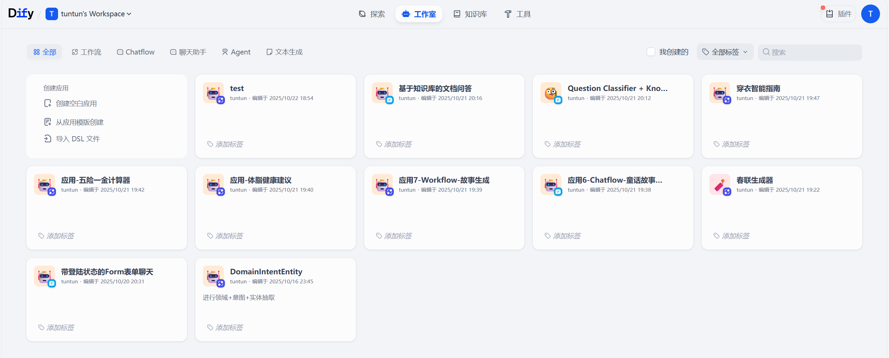
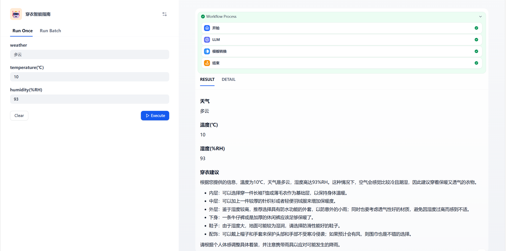
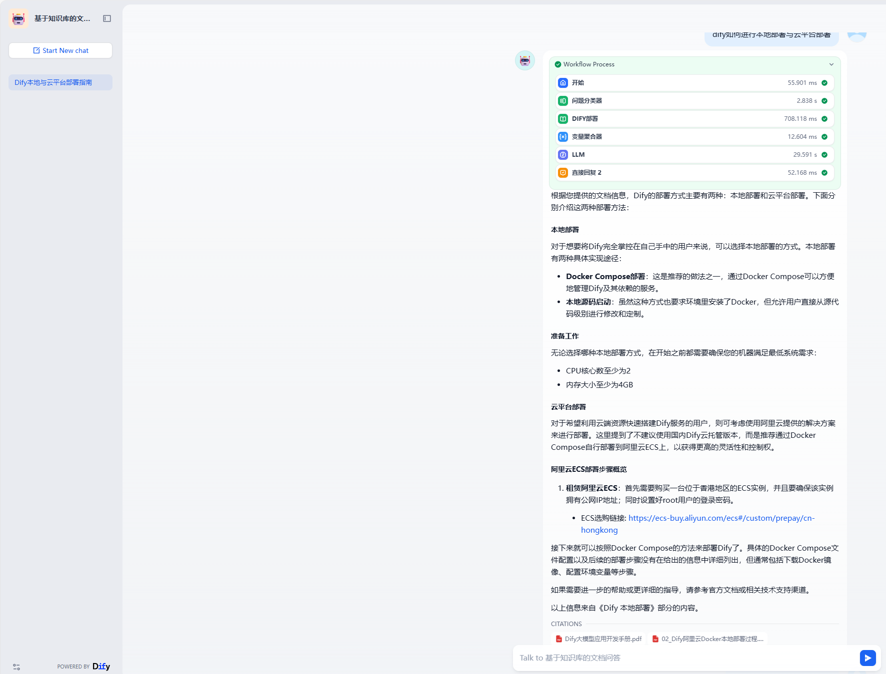

# dify本地部署截图

# dify工作流与对话流对比
- 工作流(workflow)主要用于自动化和批处理情景中处理复杂业务逻辑，更适合不需要考虑上下文连续性的情况，即每次操作都是独立完成的任务；应用场景更多地集中在一次性任务执行上，而不是持续的对话过程
- 对话流(chatflow)则更侧重于解决自然语言输入中的用户意图识别问题，更适用于需要保持会话状态（例如记住之前的对话内容）的应用场景，能够更好地处理基于对话的服务请求；在对话流中，可以使用会话变量来临时存储特定信息，这些信息可以在当前会话内的多轮对话中被引用。这有助于提高LLM的理解准确性，避免因记忆错误而导致的信息偏差

# dify-穿衣指南运行截图

# dify-知识问答运行截图

