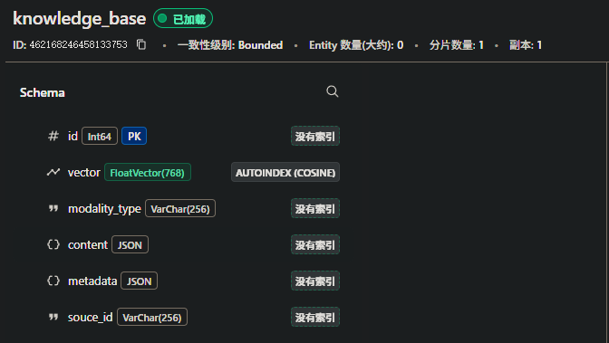

# Week11-李云道

[toc]

## 【作业1】对多模态RAG的项目，设计下接口

**需要满足**：

* 数据管理的接口、多模态检索接口、多模态问答接口
* 接口定义定义清楚，传入的参数 + 返回的结果格式

**Q**: 为什么要分开多模态检索和问答接口，前端送入用户输入后端直接输出可以吗？

**A**:合并接口确实有道理， 前端一次调用搞定所有事情， 后端处理所有复杂度， 响应时间可能更短；然而业界常常选择分开。

详见文档《week11-接口文档.xlsx》

---


## 【作业2】对多模态RAG的项目，如果用户使用【文本】提问 vs 【文本 + 图】提问，你会怎么处理？有什么区别？

只使用【文本】提问，用同一文本模型(例如bert, sbert)对提问和文档块分词，知识库中使用文本相似度计算检索top_k个，取出文本块和原始提问生成具体提示词交由大模型对提问做回答；

使用【文本+图】提问，则需要把文本和图映射到同一语义向量空间，有多种方式：一，可借助CLIP或BGE等多模态模型，分别提取特征，再计算特征向量的相似度；二，利用有图片理解能力的模型，例如Qwen-VL或Deepseek-OCR，把图片转为文字描述，再借助文本模型的语义理解比较文本之间的相似度；


## 【作业3】对多模态RAG的项目，milvus如果要存储文本、图、表，数据结构如何设计？

### 方案一 统一向量空间

利用多模态模型(eg.CLIP)将所有数据映射到同一向量空间，并设置json元数据、源文档序列



```json
{
  "collection_name": "knowledge_base",
  "description": "",
  "fields": [
    {
      "name": "id",
      "data_type": 5,
      "description": "",
      "is_primary_key": true,
      "autoID": false
    },
    {
      "name": "vector",
      "data_type": 101,
      "description": "统一特征向量",
      "is_primary_key": false,
      "dim": 768,
      "indexes": [
        {
          "index_name": "",
          "index_type": "AUTOINDEX",
          "metric_type": "COSINE",
          "indexParameterPairs": [
            {
              "key": "index_type",
              "value": "AUTOINDEX"
            },
            {
              "key": "metric_type",
              "value": "COSINE"
            },
            {
              "key": "mmap.enabled",
              "value": "false"
            }
          ]
        }
      ]
    },
    {
      "name": "modality_type",
      "data_type": 21,
      "description": "模态类型：text/image/table",
      "is_primary_key": false,
      "is_partition_key": false,
      "nullable": true,
      "max_length": 256,
      "mmap.enabled": false
    },
    {
      "name": "content",
      "data_type": 23,
      "description": "原始内容，例如{\n    \"text\": \"2023年销售额增长20%\",\n    \"chunk_index\": 1\n  }",
      "is_primary_key": false,
      "nullable": false,
      "max_length": 256
    },
    {
      "name": "metadata",
      "data_type": 23,
      "description": "元数据，例如{\n    \"source\": \"年报.pdf\",\n    \"page\": 5,\n    \"language\": \"zh\"\n  }",
      "nullable": false
    },
    {
      "name": "souce_id",
      "data_type": 21,
      "description": "源数据索引，对应关系型数据库中数据",
      "is_primary_key": false,
      "is_partition_key": false,
      "nullable": false,
      "max_length": 256
    }
  ],
  "functions": [],
  "consistency_level": "Bounded",
  "shards_num": 1
}
```

### 方案二 多向量空间

项目`05-product-search-matching`中，同时存储`image_clip_vector`, `text_bge_vector`, `text_clip_vector`，以应对不同模态问答。

对于文本、图、表，可存储由文本模型提取的` text_embedding`、由图像模型提取的` image_embedding`、表格专用编码器提取的 `table_embedding`，以及`模态类型modality_type`、`原始内容content`、`元数据metadata`、`源数据索引souce_id`。

根据检索类型，取不同特征；当输入为多模态时，需要加权聚合。

---

## 附录 docker启动milvus和attu browser

为学习milvus，以及可视化数据库

```yaml
services:
  etcd:
    container_name: milvus-etcd
    image: quay.io/coreos/etcd:v3.5.5
    environment:
      - ETCD_AUTO_COMPACTION_MODE=revision
      - ETCD_AUTO_COMPACTION_RETENTION=1000
      - ETCD_QUOTA_BACKEND_BYTES=4294967296
    volumes:
      - ${DOCKER_VOLUME_DIRECTORY:-.}/volumes/etcd:/etcd
    command: etcd -advertise-client-urls=http://127.0.0.1:2379 -listen-client-urls http://0.0.0.0:2379 --data-dir /etcd

  minio:
    container_name: milvus-minio
    image: minio/minio:RELEASE.2023-03-20T20-16-18Z
    environment:
      MINIO_ACCESS_KEY: minioadmin
      MINIO_SECRET_KEY: minioadmin
    volumes:
      - ${DOCKER_VOLUME_DIRECTORY:-.}/volumes/minio:/minio_data
    command: minio server /minio_data
    healthcheck:
      test: ["CMD", "curl", "-f", "http://localhost:9000/minio/health/live"]
      interval: 30s
      timeout: 20s
      retries: 3

  standalone:
    container_name: milvus-standalone
    image: milvusdb/milvus:v2.3.3
    command: ["milvus", "run", "standalone"]
    environment:
      ETCD_ENDPOINTS: etcd:2379
      MINIO_ADDRESS: minio:9000
    volumes:
      - ${DOCKER_VOLUME_DIRECTORY:-.}/volumes/milvus:/var/lib/milvus
    ports:
      - "19530:19530"
      - "9091:9091"
    depends_on:
      - "etcd"
      - "minio"

  attu:
    container_name: milvus-attu
    image: zilliz/attu:latest
    ports:
      - "18000:3000"
    environment:
      - MILVUS_URL=standalone:19530  # 使用服务名
    depends_on:
      - "standalone"
    restart: unless-stopped

```

