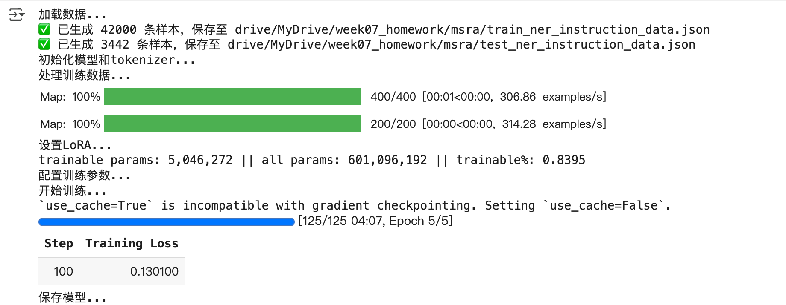
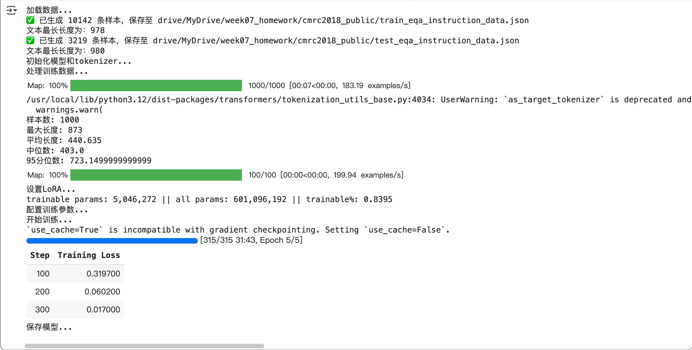
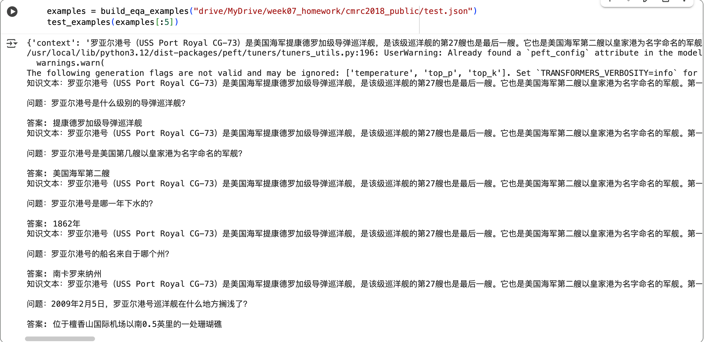

# 作业1
- 内容：理解 03_DeepWalk.py 的原理，运行并进行可视化。回答 03_DeepWalk 与 word2vec的关系。
- 作业地址：[task1](./task1.md)

# 作业2
- 内容：用Qwen-LoRA方法，微调一个识别模型，数据集参考：04_BERT实体抽取.py
- 作业地址：[task2_NER_Qwen-LoRA.py](./task2_NER_Qwen-LoRA.py)
- 训练过程损失变化：
  
- 部分测试样例：
  

# 作业3
- 内容：用Qwen-LoRA方法，微调一个识别模型，数据集参考：05_BERT知识问答.pt
- 作业地址：[task3_EQA_Qwen-LoRA.py](./task3_EQA_Qwen-LoRA.py)
- 训练过程损失变化：
  
- 部分测试样例：
  
