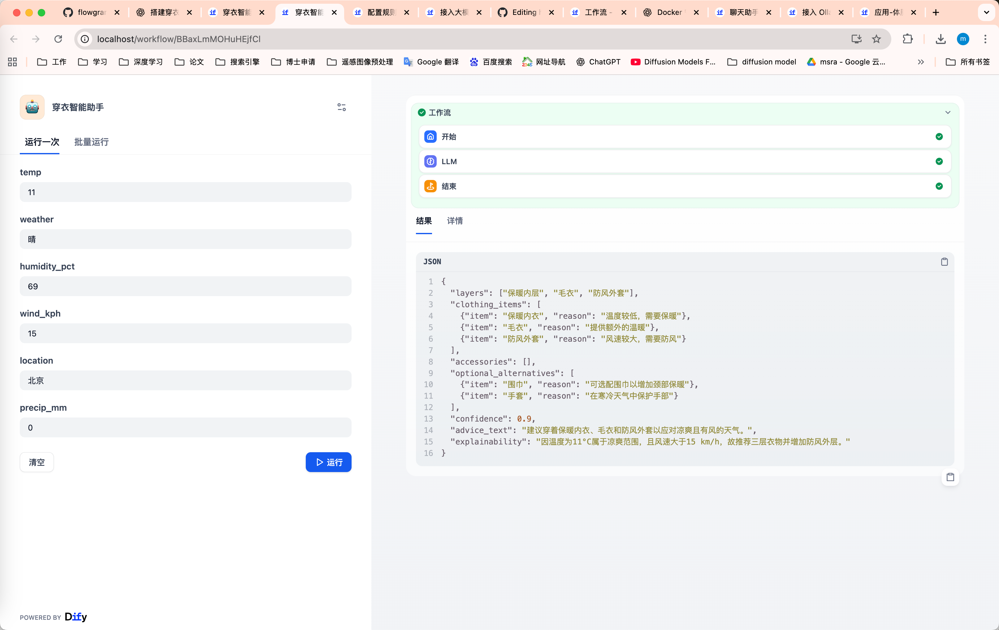
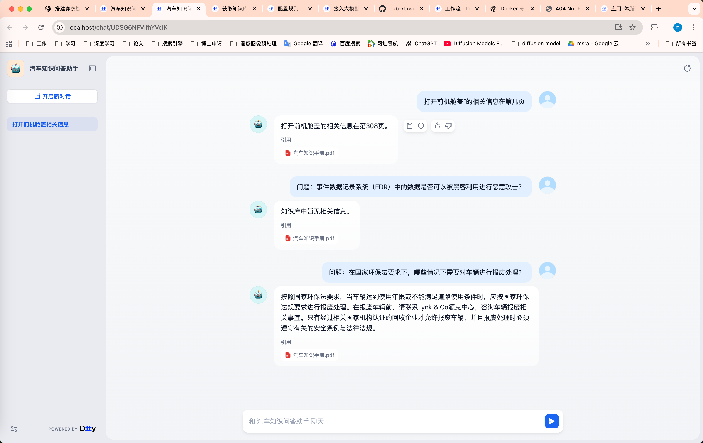

## 【作业1】  
大家通过本地 或 docker 安装dify，对比下工作流和对话流的使用。
```

================= 对话流（Conversation Flow） =================
用户输入
   │
   ▼
[ Dify 接收消息 ]
   │
   ▼
[ 模型（Ollama / LLM）生成回复 ]
   │
   ▼
[ Redis / PostgreSQL 保存会话状态 ]
   │
   ▼
用户看到回复
   │
   └─> 可以继续下一轮对话（循环）

特点：
- 实时交互
- 用户驱动
- 多轮会话管理
==============================================================


================= 工作流（Workflow） =================
触发事件（用户操作 / 定时 / 外部系统）
   │
   ▼
[ 工作流引擎 ]
   │
   ├─> 步骤 1: 数据预处理 / API 调用
   │
   ├─> 步骤 2: 调用模型生成文本 / 预测
   │
   ├─> 步骤 3: 条件分支 / 循环 / 逻辑判断
   │
   └─> 步骤 N: 输出结果到数据库 / 发送邮件 / 返回用户
   │
   ▼
触发下一次事件或完成流程

特点：
- 自动化任务链
- 多步骤、多系统交互
- 条件分支和外部调用
==============================================================

```
## 【作业2】  
使用dify搭建一个穿衣智能指南，输入天气、温度、湿度，让大模型给出穿衣建议。  
作业地址 [穿衣助手](./穿衣智能助手.yml)
运行结果展示：

## 【作业3】  
创建一个知识库，上传一些文档，在dify实现基于文档的问答。  
作业地址 [汽车知识问答助手](./汽车知识问答助手.yml)
运行结果展示：  
  
通过url访问服务：  
命令入下：  
```
curl -X POST http://localhost:5001/v1/chat-messages \
  -H "Authorization: Bearer <tocken>" \
  -H "Content-Type: application/json" \
  --data-raw '{
    "inputs": {},
    "query": "汽车发动机的主要部件有哪些？",
    "response_mode": "blocking",
    "conversation_id": "",
    "user": "abc-123"
      }'
```
